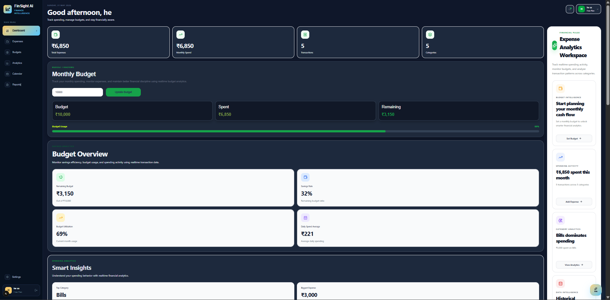
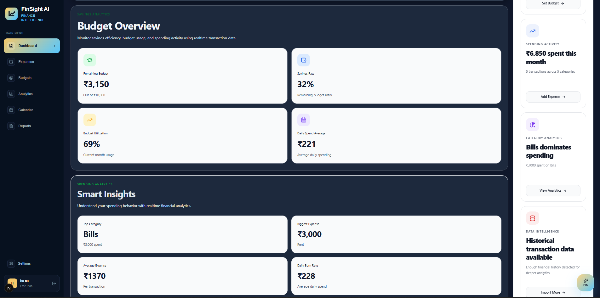
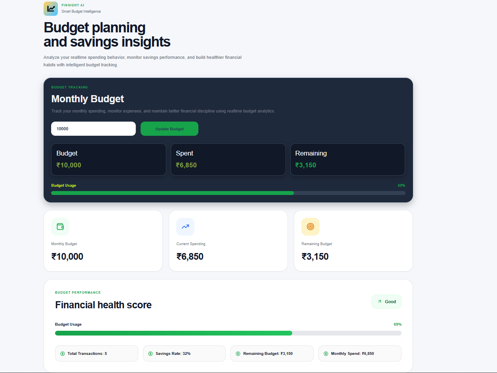
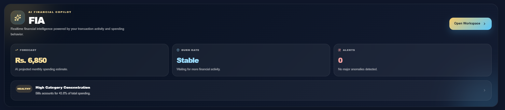
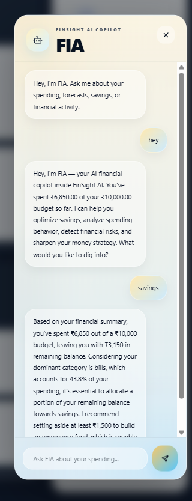
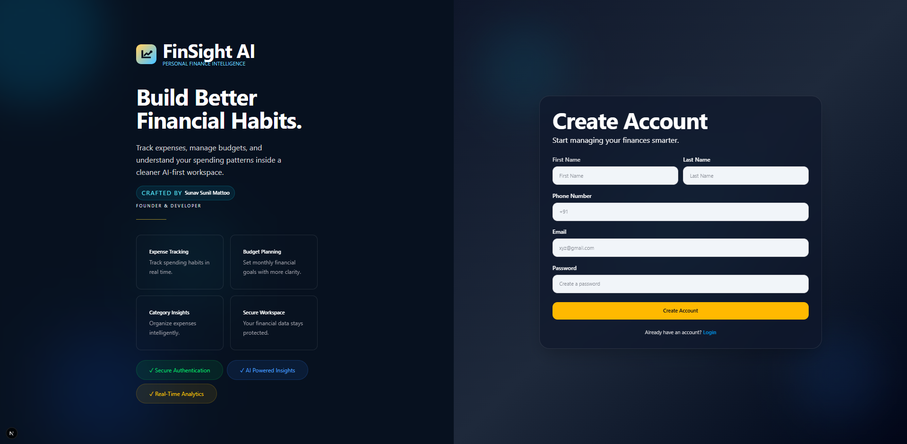

# FinSight AI

AI-powered personal finance intelligence platform built with `Next.js`, `Firebase`, and `FastAPI`.

FinSight AI helps users track expenses, manage monthly budgets, visualize spending behavior, and receive AI-generated forecasts, alerts, and conversational financial guidance through the FIA copilot workspace.


*Live Website:** https://finsight-ai-771q.vercel.app


## Table of Contents

- [Overview](#overview)
- [Core Features](#core-features)
- [Screenshots](#screenshots)
- [Tech Stack](#tech-stack)
- [Architecture](#architecture)
- [Project Structure](#project-structure)
- [Getting Started](#getting-started)
- [Environment Variables](#environment-variables)
- [API Reference](#api-reference)
- [Deployment Notes](#deployment-notes)
- [License](#license)

## Overview

FinSight AI is a full-stack financial dashboard designed for modern personal money management. The frontend provides an elegant dashboard and authentication flow, while the backend delivers AI-assisted forecasting, anomaly detection, budget monitoring, smart alerts, category intelligence, trend analysis, and chat-based financial assistance.

This repository is organized as a monorepo with:

- `client/` for the `Next.js` application
- `ai-engine/` for the `FastAPI` analytics and AI service
- `screenshots/` for product visuals used in this README

## Core Features

- Secure authentication flow with Firebase Auth
- Realtime expense tracking backed by Firestore
- Monthly budget planning and budget utilization insights
- Spending analytics with charts, category breakdowns, and trend views
- CSV-style transaction import workflow
- AI forecasting for projected monthly spend
- Burn-rate analysis and anomaly detection
- Smart alerts and financial recommendations
- FIA copilot chat interface for personalized financial guidance

## Screenshots

### Landing Page



### Dashboard Overview



### Budget Workspace



### AI Snapshot



### FIA Chat Copilot



### Registration Experience



## Tech Stack

### Frontend

- `Next.js 16`
- `React 19`
- `Tailwind CSS 4`
- `Firebase Auth`
- `Cloud Firestore`
- `Firebase Storage`
- `Recharts`

### Backend

- `FastAPI`
- `Uvicorn`
- `Pandas`
- `NumPy`
- `Scikit-learn`
- `Prophet`
- `Groq`

## Architecture

1. Users authenticate through Firebase Auth.
2. Expense, budget, settings, and notification data are stored in Firestore.
3. The frontend sends summarized transaction data to the FastAPI AI engine.
4. The AI engine returns:
   - spending forecasts
   - category analysis
   - trend analysis
   - anomaly detection
   - burn-rate evaluation
   - smart alerts
   - recommendations
   - conversational chat responses
5. The frontend renders those results inside the dashboard and FIA workspace.

## Project Structure

```text
finsight-ai/
|-- ai-engine/
|   |-- app/
|   |   |-- main.py
|   |   |-- forecast.py
|   |   |-- insights.py
|   |   |-- anomaly.py
|   |   |-- recommendations.py
|   |   |-- chat_engine.py
|   |   |-- category_intelligence.py
|   |   |-- trend_analysis.py
|   |   |-- burn_rate.py
|   |   `-- smart_alerts.py
|   |-- .env.example
|   `-- requirements.txt
|-- client/
|   |-- src/
|   |   |-- app/
|   |   |-- components/
|   |   |-- context/
|   |   `-- lib/
|   |-- public/
|   `-- package.json
|-- screenshots/
|-- LICENSE
`-- README.md
```

## Getting Started

### 1. Clone the repository

```bash
git clone https://github.com/sunav1411/finsight-ai.git
cd finsight-ai
```

### 2. Start the frontend

```bash
cd client
npm install
npm run dev
```

The frontend runs on `http://localhost:3000`.

### 3. Start the AI backend

Open a second terminal:

```bash
cd ai-engine
pip install -r requirements.txt
uvicorn app.main:app --reload
```

The backend runs on `http://localhost:8000`.

## Environment Variables

### Frontend: `client/.env.local`

```env
NEXT_PUBLIC_API_URL=http://localhost:8000
NEXT_PUBLIC_FIREBASE_API_KEY=
NEXT_PUBLIC_FIREBASE_AUTH_DOMAIN=
NEXT_PUBLIC_FIREBASE_PROJECT_ID=
NEXT_PUBLIC_FIREBASE_STORAGE_BUCKET=
NEXT_PUBLIC_FIREBASE_MESSAGING_SENDER_ID=
NEXT_PUBLIC_FIREBASE_APP_ID=
```

### Backend: `ai-engine/.env`

```env
GROQ_API_KEY=
```

## API Reference

### `GET /`

Health-style home route.

Response:

```json
{
  "message": "FinSight AI Engine Running"
}
```

### `POST /predict`

Runs analytics and prediction logic on a user expense payload.

Request body:

```json
{
  "expenses": [
    {
      "amount": 1200,
      "category": "Food",
      "date": "2026-05-01"
    }
  ],
  "budget": 10000
}
```

Response includes:

- `prediction`
- `insights`
- `recommendations`
- `anomalies`
- `category_analysis`
- `trend_analysis`
- `burn_rate`
- `smart_alerts`

### `POST /chat`

Generates contextual FIA chat responses based on the user message, expenses, and budget.

## Deployment Notes

- Deploy the frontend separately from the AI backend.
- Set `NEXT_PUBLIC_API_URL` to the deployed FastAPI base URL in production.
- Configure Firebase Auth, Firestore, and Storage before using the dashboard end to end.
- Keep `GROQ_API_KEY` on the backend only and never expose it in the frontend.
- If deploying the FastAPI service to a cloud host, confirm `prophet` support in the target runtime because it can require heavier dependencies than typical API deployments.

## License

This project is licensed under the [MIT License](./LICENSE).
